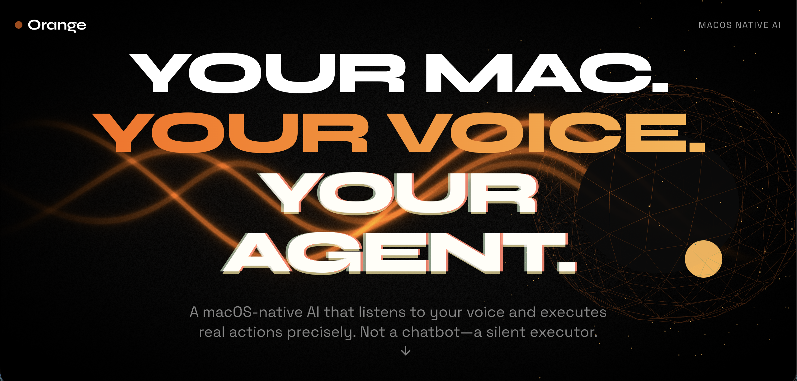
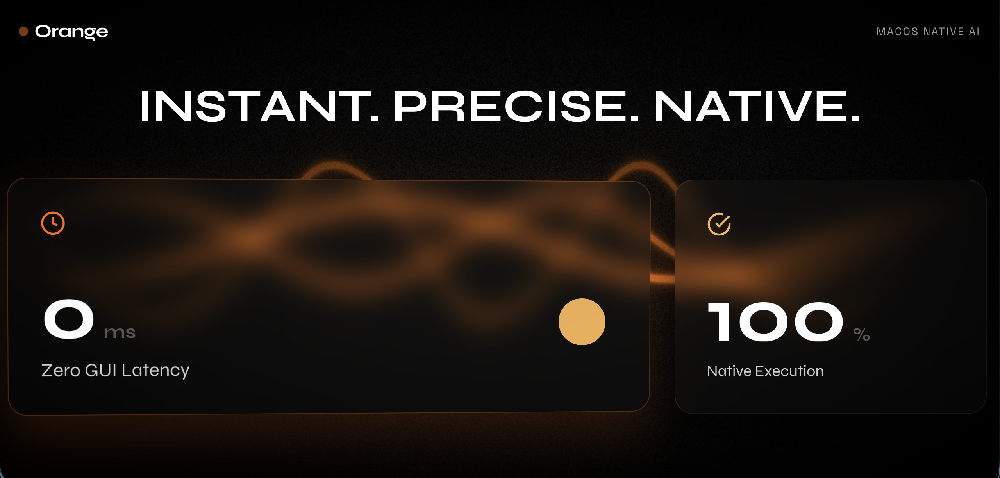

# Orange

Orange is a macOS voice-to-action agent with a native Swift desktop runtime and an embedded Python sidecar.
This release track is **BYOK Anthropic only**: no login, no payments, no subscription gating.

## Screenshots





## Repository Layout

- `apps/desktop`: SwiftUI macOS app runtime, onboarding, execution, and sidecar bridge.
- `agent`: FastAPI sidecar for planning, verification, streaming events, and provider checks.
- `vendor/macos-use`: Vendored upstream planner primitives from browser-use.
- `backend`: out-of-path scaffolding (not required for BYOK desktop runtime).
- `website`: marketing + beta funnel.
- `scripts`: build, notarize, release tooling.

## Local Dev Quick Start (BYOK)

### 1) Install sidecar dependencies

```bash
cd agent
python3.13 -m venv .venv
source .venv/bin/activate
pip install -r requirements.txt
```

### 2) Run the macOS app

```bash
cd ../apps/desktop
swift build
swift run
```

### 3) First run flow

1. Enter your Anthropic API key in the app prompt.
2. Grant Accessibility, Microphone, and Screen Recording permissions.
3. Use the hotkey (Cmd+Shift+O) to start speaking commands.

Notes:
- In dev mode, the app can launch the sidecar via local Python fallback.
- In packaged DMG builds, the sidecar is bundled and does not require Python on user machines.

## Sidecar APIs

- `POST /v1/plan`: transcript + context -> `ActionPlan`
- `POST /v1/verify`: action history + before/after context -> verification result
- `GET /v1/events/{session_id}`: SSE planner progress stream
- `GET /v1/provider/status`: provider + key + model + health status
- `POST /v1/provider/validate`: validate Anthropic key

## Build Signed + Notarized DMG

### Required environment

- `APPLE_DEVELOPER_ID_APPLICATION` (Developer ID Application certificate name)
- `APPLE_NOTARY_PROFILE` (recommended) or:
  - `APPLE_ID`
  - `APPLE_TEAM_ID`
  - `APPLE_APP_SPECIFIC_PASSWORD`
- `SPARKLE_BASE_URL` (for appcast generation)

Optional:
- `ORANGE_VERSION` (default: `0.9.0-beta.1`)
- `APP_NAME` (default: `Orange`)

### Release command

```bash
./scripts/release.sh
```

This performs:
1. Sidecar bundle build (`PyInstaller`) and app bundle assembly.
2. Code signing (app + nested sidecar + DMG).
3. Notarization submit/wait + stapling.
4. Sparkle appcast generation.

## Release Checklist

1. `cd apps/desktop && swift build`
2. `cd agent && source .venv/bin/activate && pytest -q`
3. `./scripts/release.sh`
4. Verify DMG install on fresh macOS machine.
5. Confirm first-run path: key entry -> permissions -> command execution.

## Notes

- `vendor/macos-use` is read-only. Integration lives in `agent/macos_use_adapter/`.
- Unknown action kinds are rejected (fail-closed).
- API keys are stored in macOS Keychain and injected into sidecar environment at launch.
