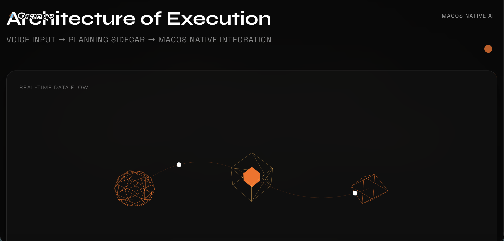

# Orange

Orange is a macOS voice-to-action agent with a native Swift desktop runtime and a Python planning sidecar.

## Screenshots





## Repository Layout

- `apps/desktop`: SwiftUI macOS app scaffold, contracts, and session state machine.
- `agent`: FastAPI sidecar with versioned `/v1/plan`, `/v1/verify`, and `/v1/events` APIs.
- `vendor/macos-use`: Vendored upstream planner code from browser-use.
- `backend`: Backend API scaffold for auth, usage, and billing webhooks.
- `website`: Next.js marketing site scaffold.
- `scripts`: Build and release scripts.

## Quick Start

### 1) Python sidecar

```bash
cd agent
python3.13 -m venv .venv
source .venv/bin/activate
pip install -r requirements.txt
uvicorn app.main:app --host 127.0.0.1 --port 7789 --reload
```

### 2) Swift app package

```bash

```

## Contract-First APIs

- `POST /v1/plan`: transcript + context -> `ActionPlan`
- `POST /v1/verify`: action history + before/after context -> verification result
- `GET /v1/events/{session_id}`: SSE event stream for live UI updates

## Notes

- `vendor/macos-use` is a read-only mirror. Integration goes through `agent/macos_use_adapter/`.
- Unknown action kinds are rejected (fail-closed behavior).
